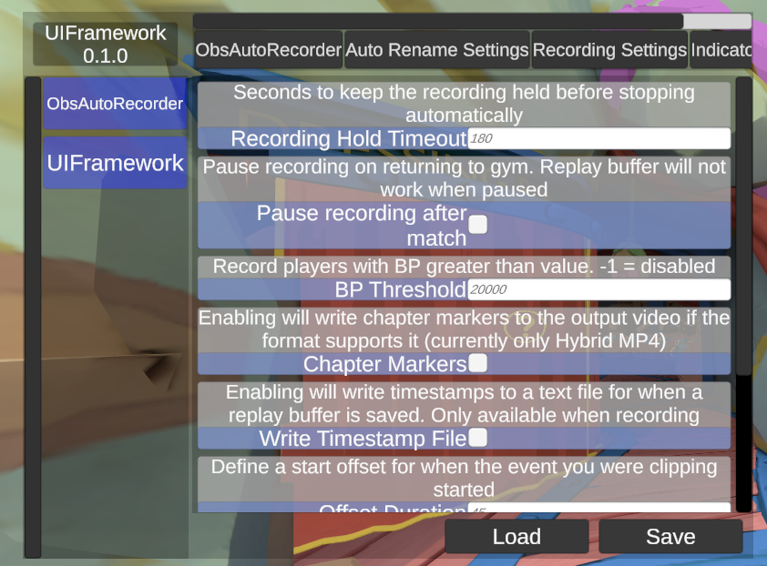


# UI Framework
## Default toggle button is F9
## End goal
A modular UI where people can create their own instances and be interactable in VR with optional panels that can be pinned in scenes.

# Usage Overview
## As melon preferences interface

### Example Usage

**<details><summary> Standard Melon preferences declaration example </summary>**
https://melonwiki.xyz/#/modders/preferences?id=melon-preferences
```
private const string USER_DATA = "UserData/TestMod/";
private const string CONFIG_FILE = "config.cfg";
if (!Directory.Exists(USER_DATA))
    Directory.CreateDirectory(USER_DATA);

private MelonPreferences_Category TestCategory1;
private MelonPreferences_Entry<string> TestEntry11;
private MelonPreferences_Entry<int> TestEntry12;

private MelonPreferences_Category TestCategory2;
private MelonPreferences_Entry<float> TestEntry21;
private MelonPreferences_Entry<bool> TestEntry22;


TestCategory1 = MelonPreferences.CreateCategory("Test Cat 1");
TestCategory1.SetFilePath(Path.Combine(USER_DATA, CONFIG_FILE));
TestEntry11 = TestCategory1.CreateEntry("Entry 1-1", "Test Val", null, "Test String");
TestEntry12 = TestCategory1.CreateEntry("Entry 1-2", 1, null, "Test Int");

TestCategory2 = MelonPreferences.CreateCategory("Test Cat 2");
TestCategory2.SetFilePath(Path.Combine(USER_DATA, CONFIG_FILE));
TestEntry21 = TestCategory1.CreateEntry("Entry 2-1", "0.5126", null, "Test float");
TestEntry22 = TestCategory1.CreateEntry("Entry 2-2", true, null, "Test bool");
```
</details>

#### Registering MelonPreferences_Category to UI Framework
Registration should be done in OnLateInitializeMelon. I'll figure out late registration later.
```
public override void OnLateInitializeMelon()
{
	Preferences.InitializePrefs();
	UIFramework.Register(this, TestCategory1, TestCategory2);
}
```

####
Configuring Custom Widgets


-----
### Quick layout mockup
<sup>Looks will be improved. The current color scheme is to show me the boundaries between panels and make sure they've been placed correctly</sup>


-----
-----
-----


#### The rest of this is for more advanced usage like custom UI creation, supporting additional data types or contribution
-----

# Usage details 
When mods register themselves and their Melonpreferences_Category instances to the UI Framework, a model instance is created for the mod, for each of the categories that have been registered with it, and each of the entries under those and then they are added under the root model that contains all mods that have been registered.

When you give a UI Controller for a container an appropriate model it will iterate through the submodels under that and create appropriate UI elements to be parented to the container.

In this case, the root model that contains all mods is given to the sidebar controller which creates buttons that represent each mod.

Clicking a mod button on the sidebar will give the controller for the top bar the category submodels that are registered to that mod.

Clicking a category button on the top bar will populate the main panel/preference list. 

One thing to note is that the game object for the individual preferences is contained in the Entry submodel. This allows you to make your custom widgets which will be retrieved and instantiated by the preferences list control.
If none is provided, it will default to the [standard input](#defaults) based on the type of the entry.


# Design Pattern

# MVC/MVP(ish)-Inspired Pattern

The intention is to have separation of UI and data logic. Make the UI itself disposable while the model would be the one source of truth it can be rebuilt from every time.

This also allows it to be modular where other modders can make their own model instance and spin up their own UI for it with a separate panel from everyone else's.


## Model: 
The model serves as the basis of the structure of the interface. 
There is one main model instance but in theory, you can create your own model instances for custom behaviours or if you wanna make your own windows.

Models should avoid references to the view or the controllers as much as possible. This includes event subscribers.


## Submodels:
### Mod
A mod instance in the model. Each mod instance can have one entry in the model. 

Their equivalent buttons will show up on the sidebar

### Category
A wrapper/adapter class around a MelonPreferences_Category type. While the framework is based on MelonPreferences, it should be possible for modders to make their own settings system as long as they expose a compatible interface for the adapter. 

Their equivalent buttons will show up on the top bar

#### Entry
A wrapper/adapter class around a MelonPreferences_Category type. 

Their equivalent UI elements will show up in the main panel when their category is selected.
They have a description, a label/ID, and an actual input area

## Controllers: 
Custom components added to the ugui game objects that controls them based on the model
Each controller has a reference to the model they're supposed to represent to the user. 

## UI: 
The actual interface the user interacts with. 

# UI Creation
## Standard
Standard registration automatically creates a UI for the mod. 
`UI.Register(this, TestCategory1, TestCategory2);`
Standard registration gives you default input controls in the UI for each type.
<sup>Default input controls could change between versions</sup>

### Defaults: 
|Type|Input control|
|---|---|
|string|Standard Text Input|
|int|Text Input with numeric filter|
|float|Text input with numeric filter and decimal support|
|double|Text input with numeric filter and decimal support|
|bool|toggle|
|enum|Dropdown|
|[custom]|Button|

### Future features
|Type|Input control|
|---|---|
|enum \[flags\]|Multi-checkboxes|
|Int, float, double|slider|


## Custom model proposal (these have not been implemented yet and methodnames will change)
### Proposal 0: You can design your own models before registration
(Assuming you already created the melonpreferences structure)
UIFModel.Mod MyMod = new();


```
UIFModel.CatModel catAdapter1 = new UIFModel(TestCategory1);
catAdapter1.FindEntry("Test Entry1").InputType.Slider;
```

#### Proposal 1: Registration provides you with the model that was just created from your input. You can then search and apply customizations there.

```
UIFModel.ModelMod MyMod = UIFramework.Register(this, MelonPreferences_Category[])
MyMod.GetCategory("Category1").GetEntry("Entry1).SetUIWidget(UIFramework.Assets.PrefTextEntry)
```

You can also use this as a point to create your own customWidget
```
MyMod.GetCategory("Category1").GetEntry("Entry1).SetUIWidget(MyCustomGameObject)
```
Custom Game Objects need a component that implements the UIFController.PreferenceEntry class


## (OLD) Proposal for custom interface usage
<details>
### Option 1: Copy Melonpreferences process
> [!NOTE]
> Do we want interface creation to resemble MelonPreferences? Gives users a familiar pattern but does add a few steps

```
public class UI_Category
{
    
}

public class UI_Entry
{
    public class Button{}
    public class Text{}
}

private UI_Category TestTab1;
private UI_Entry<UI_Entry.Button> TestButton1;
private UI.TextEntry<UI_Entry.Text> TestText1;

//Make UI entry creation similar to preferences creation
TestTab1 = UIInterface.CreateCategory("Test Tab 1"); 

//What would the default value for a button even be?
TestButton1 = TestTab1.CreateEntry("Test Button 1", /*???*/, null, "This is just a test default ");
TestText1 = TestTab1.CreateEntry("Test Textbox 1", "Default Text", null, "This is just a test textbox default");
```

### Option 2: Create our own
> [!NOTE] 
> These options are not compatible with current implementations
```
private UI.Tab TestTab1 = new UI.Tab("Title text");
private UI.Button Entry1 = new UI.Button();
Entry.OnClick += Entry1Click;

TestTab1.AddControl(Entry1);

Entry1_Click(Button1 sender)
{
    //stuff
}
```

#### Option 2.5: Fluent style


```
public void Button1_Click(Button1 sender, Params p)
{

}

public void Text1_Input(Text1 sender, Params p)
{

}

public void Apply()
{

}
TestTab1 = new UI.Tab("Title Text)
    .WithDefaultActionButton(true) //this would be the save button on a regular MelonPreferences tab. If on a non pref tab, the user can subscribe to its onclick event
    .DefaultAction(Apply)
    .AddControl(new Button()
        .WithDescription("This is a test button")
        .WithText("Button1")
        .AddOnClick(Button1_Click)
        .Build()
    )
    .AddControl(new Textbox()
        .WithDescription("This is a test textbox")
        .WithText("Default Text 1")
        .AddOnTextChanged(Text1_Input)
        .Build()
    ).Build();
    
```
</details>